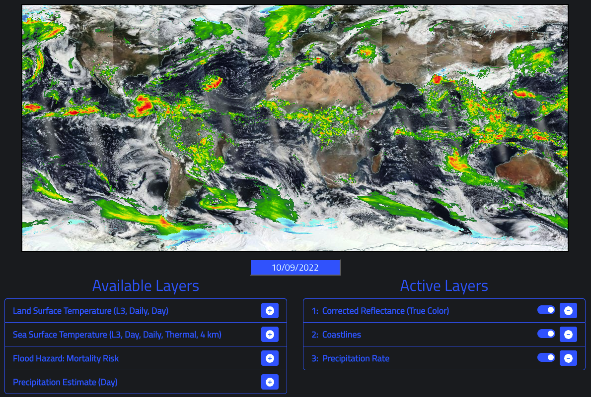

# OpenLayers NASA GIBS React Map

### OpenLayers map using Global Imagery Browse Services (NASA GIBS) with React components

- Add & remove raster layers
- Toggle visibility for active layers
- Reorder active layers
- Change date of active layers



## Install

```bash
git clone https://github.com/ryanweiler92/OpenLayers-NASA-GIBS-React-Map.git
cd openlayers-nasa-gibs-react-map
npm install
```

## Usage

```bash
npm start
```

Navigate to [`http://localhost:3000`](http://localhost:3000) in a browser. To stop press Control+C in the terminal.


Created by **Ryan Weiler**